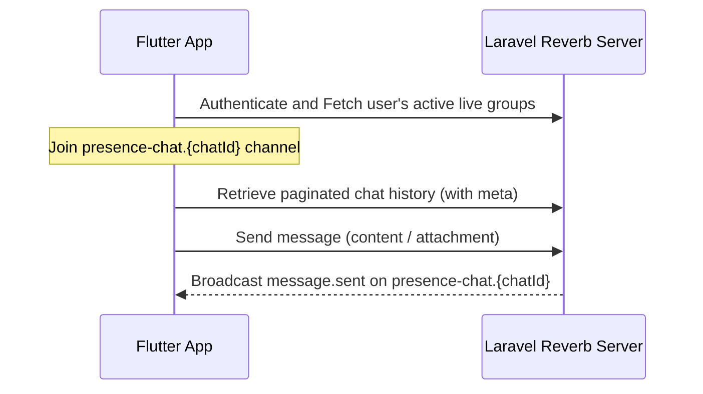

# Live Group Chat Flow (Admin-Created Groups)

This document maps the step-by-step developer integration flow for Live Chat Groups created by Administrators.

---

## 1. Step-by-Step Flow



1. **Fetch Groups**: The app retrieves the list of live groups the logged-in user belongs to.
2. **Display & Join Channel**: The user opens a group chat. The app subscribes to the presence channel (`presence-chat.{chatId}`) to monitor online members and status.
3. **Load Chat Room**: The app fetches message history. The payload includes chat metadata (`unread_count`, etc.).
4. **Sending Messages**: The user types a message and sends it. It is marked as `sent` instantly.
5. **Real-time Synchronization**: The server broadcasts `message.sent` and `message.read` events to sync chat state dynamically.

---

## 2. API Endpoints

### 2.1 List Live Groups
* **Endpoint**: `GET /api/v1/live-chat-groups`
* **Headers**:
  ```http
  Authorization: Bearer <token>
  Accept: application/json
  ```
* **Response `200 OK`**:
  ```json
  {
    "status": true,
    "message": "Success",
    "data": {
      "groups": [
        {
          "id": 1,
          "name": "General Discussion",
          "slug": "general-discussion",
          "description": "Public chat for all members",
          "chat_mode": "everyone",
          "is_active": true,
          "chat_id": 5,
          "participants_count": 142,
          "last_message": {
            "id": 100,
            "chat_id": 5,
            "content": "Welcome to the group!",
            "message_type": "text",
            "created_at": "2026-06-24T10:30:00.000000Z"
          },
          "is_banned": false,
          "is_muted": false,
          "created_at": "2026-06-01T10:00:00.000000Z"
        }
      ]
    }
  }
  ```

### 2.2 Get Group Details (with Members)
* **Endpoint**: `GET /api/v1/live-chat-groups/{id}?page=1`
* **Response `200 OK`**:
  ```json
  {
    "status": true,
    "message": "Success",
    "data": {
      "group": {
        "id": 1,
        "name": "General Discussion",
        "slug": "general-discussion",
        "description": "Public chat for all members",
        "chat_mode": "everyone",
        "is_active": true,
        "chat_id": 5,
        "created_by": {
          "id": 1,
          "name": "Admin"
        },
        "created_at": "2026-06-01T10:00:00.000000Z",
        "participants": {
          "data": [
            {
              "id": 10,
              "user": {
                "id": 42,
                "name": "John Doe",
                "username": "johndoe",
                "avatar": "https://..."
              },
              "role": "member",
              "joined_at": "2026-06-01T10:05:00.000000Z",
              "is_banned": false,
              "is_muted": false,
              "muted_until": null
            }
          ],
          "current_page": 1,
          "last_page": 5,
          "total": 142
        }
      }
    }
  }
  ```

### 2.3 Fetch Messages (History / Polling)
* **Endpoint**: `GET /api/v1/chats/{chat_id}/messages`
* **Query Parameters**:
  * `after_id` (optional, integer): Returns new messages sent after this ID (used for polling).
* **Response `200 OK`**:
  ```json
  {
    "status": true,
    "message": "Success",
    "data": {
      "messages": [
        {
          "id": 100,
          "chat_id": 5,
          "content": "Hello world",
          "message_type": "text",
          "attachment_url": null,
          "is_mine": false,
          "status": "read",
          "created_at": "2026-06-24T10:30:00.000000Z",
          "sender": {
            "id": 42,
            "name": "John Doe",
            "avatar": "https://..."
          }
        }
      ],
      "meta": {
        "unread_count": 0,
        "other_user": null
      }
    }
  }
  ```

### 2.4 Send Message
* **Endpoint**: `POST /api/v1/chats/{chat_id}/messages`
* **Request Payload**:
  ```json
  {
    "content": "Hi everyone!",
    "message_type": "text",
    "reply_to_message_id": null
  }
  ```
* **Response `201 Created`**:
  ```json
  {
    "status": true,
    "message": "Sent",
    "data": {
      "id": 101,
      "chat_id": 5,
      "content": "Hi everyone!",
      "message_type": "text",
      "attachment_url": null,
      "is_mine": true,
      "status": "sent",
      "created_at": "2026-06-24T10:32:00.000000Z",
      "sender": {
        "id": 33,
        "name": "My Name",
        "avatar": "https://..."
      }
    }
  }
  ```

---

## 3. WebSocket Events

### 3.1 Live Chat Presence Channel
* **Channel Name**: `presence-chat.{chatId}` (Requires Sanctum Broadcast Auth)
* **Events**:
  * **`message.sent`**: Triggered when a new message is posted.
    * *Payload*:
      ```json
      {
        "id": 101,
        "chat_id": 5,
        "content": "Hi everyone!",
        "message_type": "text",
        "attachment_url": null,
        "is_mine": false,
        "status": "sent",
        "created_at": "2026-06-24T10:32:00.000000Z",
        "sender": {
          "id": 33,
          "name": "My Name",
          "avatar": "https://..."
        }
      }
      ```
  * **`message.read`**: Triggered when another member marks messages as read.
    * *Payload*:
      ```json
      {
        "chat_id": 5,
        "last_read_message_id": 101,
        "read_by": 42,
        "read_at": "2026-06-24T10:33:00.000000Z"
      }
      ```
  * **`presence.changed`**: Triggered when a user joins, leaves, or updates status in the live room.
    * *Payload*:
      ```json
      {
        "user_id": 42,
        "is_online": true,
        "last_seen_at": "2026-06-24T10:35:00.000000Z"
      }
      ```
