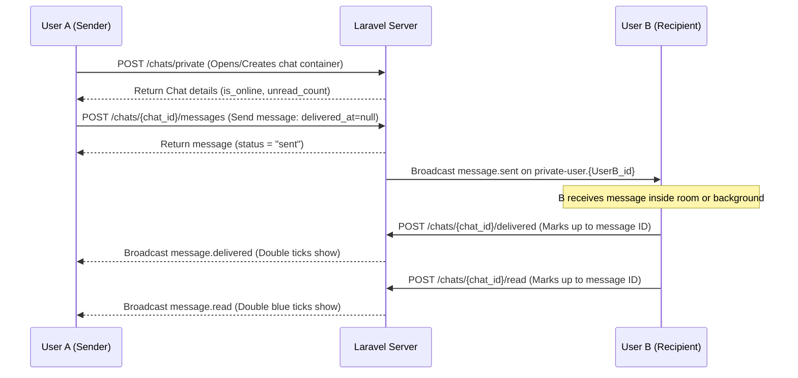

# Realtime 1-to-1 Chat Flow (Direct Messages)

This document maps the step-by-step developer integration flow for standard 1-to-1 direct messaging, online status tracking, and message state updates.

---

## 1. Step-by-Step Flow



1. **Open Direct Chat**: The app opens a direct chat window. First, it hits `/chats/private` with the other user's ID to fetch or create the unique chat container.
2. **Fetch Message History**: The app queries the history endpoint to render existing messages. The response includes `other_user` and `unread_count` metadata.
3. **Connect to WebSocket Channels**:
   - Subscribe to the background channel `private-user.{myId}` to receive message notifications, ticks, and online status changes while scrolling lists.
   - Subscribe to the screen-specific presence channel `presence-chat.{chatId}` when inside the chat window.
4. **Sending Messages**: The message is initially sent as `'sent'`. The delivery payload begins with `delivered_at => null`.
5. **Marking Delivery**: When the recipient's app loads or receives a message event, it hits the `/delivered` endpoint, changing the message state to `'delivered'` (represented by a double tick).
6. **Marking Read**: When the recipient opens the chat screen or scrolls to the bottom, the app hits the `/read` endpoint, shifting the status to `'read'` (represented by double blue ticks).

---

## 2. API Endpoints

### 2.1 Fetch Chats List (Inbox)
* **Endpoint**: `GET /api/v1/chats`
* **Response `200 OK`**:
  ```json
  {
    "status": true,
    "message": "Success",
    "data": {
      "chats": {
        "data": [
          {
            "id": 7,
            "uuid": "b8dde83c-44ad-4133-a9f4-96bc04ba0768",
            "type": "private",
            "name": "Awntika",
            "avatar": "https://www.ivatan.in/storage/...jpg",
            "is_online": true,
            "is_admin": false,
            "unread_count": 3,
            "last_message": {
              "id": 142,
              "chat_id": 7,
              "content": "Hi there!",
              "message_type": "text",
              "created_at": "2026-06-24T08:25:15.000Z"
            },
            "updated_at": "2026-06-24T08:25:15.000Z"
          }
        ]
      }
    }
  }
  ```

### 2.2 Open or Create Private Chat
* **Endpoint**: `POST /api/v1/chats/private`
* **Request Payload**:
  ```json
  {
    "other_user_id": 42
  }
  ```
* **Response `200 OK`**:
  ```json
  {
    "status": true,
    "message": "Success",
    "data": {
      "id": 7,
      "uuid": "b8dde83c-44ad-4133-a9f4-96bc04ba0768",
      "type": "private",
      "name": "Awntika",
      "avatar": "https://...",
      "is_online": true,
      "unread_count": 0,
      "last_message": null
    }
  }
  ```

### 2.3 Fetch Messages History
* **Endpoint**: `GET /api/v1/chats/{chat_id}/messages`
* **Response `200 OK`**:
  ```json
  {
    "status": true,
    "message": "Success",
    "data": {
      "messages": [
        {
          "id": 142,
          "chat_id": 7,
          "content": "Hi there!",
          "message_type": "text",
          "attachment_url": null,
          "is_mine": true,
          "status": "delivered",
          "created_at": "2026-06-24T08:25:15.000Z",
          "sender": {
            "id": 33,
            "name": "My Name",
            "avatar": "https://..."
          }
        }
      ],
      "meta": {
        "unread_count": 0,
        "other_user": {
          "id": 42,
          "name": "Awntika",
          "avatar": "https://...",
          "is_online": true
        }
      }
    }
  }
  ```

### 2.4 Send Message
* **Endpoint**: `POST /api/v1/chats/{chat_id}/messages`
* **Request Payload**:
  ```json
  {
    "content": "Hello!",
    "message_type": "text"
  }
  ```
* **Response `210 Created`**:
  ```json
  {
    "status": true,
    "message": "Sent",
    "data": {
      "id": 143,
      "chat_id": 7,
      "content": "Hello!",
      "message_type": "text",
      "attachment_url": null,
      "is_mine": true,
      "status": "sent",
      "created_at": "2026-06-24T08:26:00.000Z",
      "sender": {
        "id": 33,
        "name": "My Name",
        "avatar": "https://..."
      }
    }
  }
  ```

### 2.5 Mark as Delivered
* **Endpoint**: `POST /api/v1/chats/{chat_id}/delivered`
* **Request Payload**:
  ```json
  {
    "last_delivered_message_id": 143
  }
  ```
* **Response `200 OK`**:
  ```json
  {
    "status": true,
    "message": "Messages marked as delivered.",
    "data": null
  }
  ```

### 2.6 Mark as Read
* **Endpoint**: `POST /api/v1/chats/{chat_id}/read`
* **Request Payload**:
  ```json
  {
    "last_read_message_id": 143
  }
  ```
* **Response `200 OK`**:
  ```json
  {
    "status": true,
    "message": "Messages marked as read.",
    "data": null
  }
  ```

---

## 3. WebSocket Events

### 3.1 Inbox updates (`private-user.{myId}`)
* **`message.sent`**: Increment unread count and update last message previews in lists.
* **`message.read`**: Reset unread count for matching `chat_id`.
* **`message.delivered`**: Update double ticks status in lists.
* **`presence.changed`**: Realtime user online indicator change.
  ```json
  {
    "user_id": 42,
    "is_online": false,
    "last_seen_at": "2026-06-24T08:27:00.000Z"
  }
  ```

### 3.2 Inside Active Chat Screen (`presence-chat.{chatId}`)
* **`message.sent`**: Real-time incoming message payload.
* **`message.delivered`**: Double tick confirmation.
  ```json
  {
    "chat_id": 7,
    "message_id": 143,
    "delivered_by": 42
  }
  ```
* **`message.read`**: Double blue ticks read receipt event.
  ```json
  {
    "chat_id": 7,
    "last_read_message_id": 143,
    "read_by": 42,
    "read_at": "2026-06-24T08:26:30.000Z"
  }
  ```
