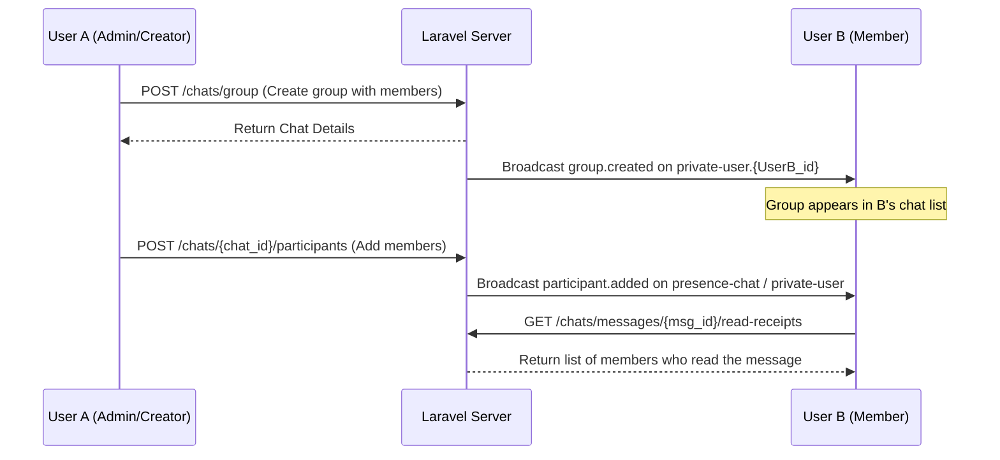

# User-Created Group Chat Flow

This document maps the step-by-step developer integration flow for Group Chats created and managed by standard Users.

---

## 1. Step-by-Step Flow



1. **Create Group**: Any user can create a group chat. The app uploads a group name, avatar image, and participant user IDs to `/chats/group`.
2. **Auto Join Notification**: Other added participants receive the `group.created` event on their background `private-user.{id}` channels. The new group instantly appears in their chat lists.
3. **Adding Members**: Only group Admins can add members. Hitting `/chats/{chat_id}/participants` triggers a `participant.added` event.
4. **Leaving / Kicking Members**:
   - Members can leave the group at any time (`POST /chats/{chat_id}/leave`).
   - Admins can kick/remove members by passing their `user_id` to the leave endpoint.
5. **Chatting**: Works identically to direct chat, broadcasting to `presence-chat.{chatId}`.
6. **Detailed Read Receipts**: Since group chats have multiple readers, users can check exactly who has read a specific message by hitting the read-receipts endpoint.

---

## 2. API Endpoints

### 2.1 Create Group Chat
* **Endpoint**: `POST /api/v1/chats/group`
* **Content-Type**: `multipart/form-data`
* **Request Payload**:
  * `name` (string, required): Group Name
  * `avatar` (file, optional): Image file
  * `participant_ids[]` (array, required): Array of user IDs (e.g. `[12, 15, 33]`)
* **Response `201 Created`**:
  ```json
  {
    "status": true,
    "message": "Group created",
    "data": {
      "id": 12,
      "uuid": "4c9d92b1-55ad-4d43-982e-9d2204ba59b6",
      "type": "group",
      "name": "Project Alpha",
      "avatar": "https://www.ivatan.in/storage/chat_avatars/hash.png",
      "is_online": false,
      "is_admin": true,
      "unread_count": 0,
      "participants_count": 4,
      "last_message": null
    }
  }
  ```

### 2.2 Add Participants to Group
* **Endpoint**: `POST /api/v1/chats/{chat_id}/participants`
* **Request Payload**:
  ```json
  {
    "member_ids": [45, 52]
  }
  ```
* **Response `200 OK`**:
  ```json
  {
    "status": true,
    "message": "Members added.",
    "data": {
      "id": 12,
      "name": "Project Alpha",
      "participants_count": 6
    }
  }
  ```

### 2.3 Leave / Remove Member
* **Endpoint**: `POST /api/v1/chats/{chat_id}/leave`
* **Request Payload** (Optional - pass `user_id` only if kicking someone else):
  ```json
  {
    "user_id": 45
  }
  ```
* **Response `200 OK`**:
  ```json
  {
    "status": true,
    "message": "Member removed."
  }
  ```

### 2.4 Get Message Read Receipts
* **Endpoint**: `GET /api/v1/chats/messages/{message_id}/read-receipts`
* **Response `200 OK`**:
  ```json
  {
    "status": true,
    "message": "Read receipts retrieved.",
    "data": {
      "readers": [
        {
          "id": 15,
          "name": "Alex",
          "avatar": "https://..."
        },
        {
          "id": 33,
          "name": "Yash",
          "avatar": "https://..."
        }
      ]
    }
  }
  ```

---

## 3. WebSocket Events

### 3.1 Background Updates (`private-user.{myId}`)
* **`group.created`**: Broadcasted to new members to append the group list in real-time.
  ```json
  {
    "chat_id": 12,
    "name": "Project Alpha",
    "avatar_url": "https://...",
    "owner_id": 33,
    "user_id": 15
  }
  ```

### 3.2 Inside Active Room (`presence-chat.{chatId}`)
* **`participant.added`**: Broadcasted when a new user is added.
  ```json
  {
    "chat_id": 12,
    "user": {
      "id": 45,
      "name": "George"
    },
    "added_by": 33
  }
  ```
* **`participant.removed`**: Broadcasted when a user is kicked.
  ```json
  {
    "chat_id": 12,
    "user_id": 45,
    "removed_by": 33
  }
  ```
* **`participant.left`**: Broadcasted when a member leaves on their own.
  ```json
  {
    "chat_id": 12,
    "user_id": 15
  }
  ```
