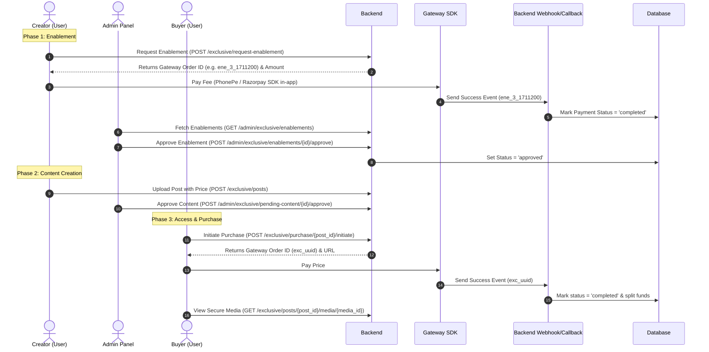

# Exclusive Content System API Documentation & Testing Guide

**Version:** 1.1  
**Last Updated:** July 2026  
**Project:** Ivatan Social Platform  

---

## 1. System Overview & Workflow

The **Exclusive Content System** allows creators to lock media (Images, Videos, Reels) behind a paywall. 



---

## 2. Phase 1: Step-by-Step Creator Enablement Flow

### Step 1: Check Current Status
Before initiating any request, check if the creator is already approved, pending approval, or requires payment.
* **Endpoint:** `GET /api/v1/exclusive/enablement-status`
* **Response:**
  ```json
  {
    "status": "none", 
    "fee_paid": 979.0,
    "payment_status": "none"
  }
  ```
  *(Status values: `none`, `pending`, `approved`, `rejected`, `disabled_by_creator`)*

### Step 2: Request Enablement (Initiate Payment)
Call this to request enablement. If a global fee is active (e.g., ₹979), it creates a pending enablement record and generates a payment gateway intent.
* **Endpoint:** `POST /api/v1/exclusive/request-enablement`
* **Response (When PhonePe is Active):**
  ```json
  {
    "success": true,
    "enablement": {
      "id": 3,
      "user_id": 46,
      "fee_paid": 979,
      "gateway": "phonepe",
      "gateway_transaction_id": "ene_3_1711200000",
      "payment_status": "pending",
      "status": "pending"
    },
    "gateway_order": {
      "id": "ene_3_1711200000",
      "amount": 97900,
      "currency": "INR"
    },
    "redirect_url": "https://mercury-t2.phonepe.com/transact/..."
  }
  ```
  * **Note on `redirect_url`:** This represents the secure checkout page URL returned by the gateway (e.g. PhonePe). Since PhonePe V1 Pay Page and V2 Standard Checkout utilize web checkout, the Flutter app must load this URL in an In-App WebView (using `webview_flutter` or similar) or open it in a system browser to let the user complete the payment transaction.

* **Response (When Razorpay is Active):**
  ```json
  {
    "success": true,
    "enablement": {
      "id": 3,
      "user_id": 46,
      "fee_paid": 979,
      "gateway": "razorpay",
      "gateway_transaction_id": "order_xyz123",
      "payment_status": "pending",
      "status": "pending"
    },
    "gateway_order": {
      "id": "order_xyz123",
      "amount": 97900,
      "currency": "INR"
    }
  }
  ```
  *Note: The `gateway_order.id` represents the gateway order/transaction ID.*

### Step 3: Complete Payment & Verify Status
Once the mobile app processes the payment via the gateway's SDK, the payment status needs to be updated from `pending` to `completed`. This happens via one of three channels:

* **Channel A (Client-Side Verification):**
  The Flutter app explicitly calls the verification endpoint after the SDK returns success:
  * **Endpoint:** `POST /api/v1/exclusive/request-enablement/verify`
  * **Payload:**
    ```json
    {
      "gateway_payload": {
        "merchantTransactionId": "ene_3_1711200000",
        "code": "PAYMENT_SUCCESS"
      }
    }
    ```
* **Channel B (Background Webhooks - Recommended for reliability):**
  The payment gateway calls the backend's webhook URL asynchronously in the background. The webhook parses the transaction ID prefix `ene_` and marks the payment as completed.
  * **PhonePe Webhook:** `POST /api/webhooks/phonepe`
  * **Razorpay Webhook:** `POST /api/webhooks/razorpay`
* **Channel C (Payment Redirect Callback):**
  If the user completes checkout via a web checkout redirect, the gateway redirects them back to the callback route, which automatically triggers verification:
  * **Route:** `GET/POST /payment/callback/phonepe?merchantTransactionId=ene_3_1711200000&code=PAYMENT_SUCCESS`

*Upon successful verification by any channel, the DB changes to:*
* `payment_status` = `completed`
* `status` = `pending` *(Now ready for admin approval)*

### Step 4: Admin Moderation
1. **View Requests:** Admin lists enablement requests. Unpaid/pending payment requests are visible but cannot be approved.
   * **Endpoint:** `GET /admin/exclusive/enablements`
2. **Approve Request:** Admin approves the creator.
   * **Endpoint:** `POST /admin/exclusive/enablements/{id}/approve`
   * **Payload (Optional):**
     ```json
     {
       "override_platform_fee_type": "percentage",
       "override_platform_fee": 5.0,
       "admin_notes": "Creator approved with customized 5% platform fee."
     }
     ```
3. **Reject Request:** Admin rejects the request.
   * **Endpoint:** `POST /admin/exclusive/enablements/{id}/reject`
   * **Payload:**
     ```json
     {
       "admin_notes": "Invalid profile verification."
     }
     ```

---

## 3. Phase 2: Exclusive Content Creation & Moderation

Once the Creator's enablement status is `approved`, they can post exclusive content.

### Step 1: Upload Post with Price
* **Endpoint:** `POST /api/v1/exclusive/posts` (Form-data)
* **Parameters:**
  * `type`: `image` | `video` | `reel`
  * `caption`: "My exclusive reel!"
  * `visibility`: `public`
  * `media`: [Binary File]
  * `price`: 500.00
* **Response:** Returns the created post object with `exclusive_status` = `'pending'`.

### Step 2: Admin Moderation of Content
* **List Pending Posts:** `GET /admin/exclusive/pending-content`
* **Approve Post:** `POST /admin/exclusive/pending-content/{id}/approve`
* **Reject Post:** `POST /admin/exclusive/pending-content/{id}/reject`

---

## 4. Phase 3: Buyer Access & Purchase Flow

### Step 1: Initiate Purchase
When a follower tries to unlock a post, they initiate a purchase intent.
* **Endpoint:** `POST /api/v1/exclusive/purchase/{post_id}/initiate`
* **Response (When PhonePe is Active):**
  ```json
  {
    "success": true,
    "purchase": {
      "id": 99,
      "buyer_id": 45,
      "user_post_id": 105,
      "final_paid_amount": 500.00,
      "status": "pending",
      "gateway_transaction_id": "exc_uuid"
    },
    "gateway_order": {
      "id": "exc_uuid",
      "amount": 50000,
      "currency": "INR"
    },
    "redirect_url": "https://mercury-t2.phonepe.com/transact/..."
  }
  ```
  * **Note on `redirect_url`:** Similar to the enablement flow, this is the web pay page URL provided by PhonePe. Flutter developers must open this URL in a WebView to let users complete the payment and trigger the status updates.

* **Response (When Razorpay is Active):**
  ```json
  {
    "success": true,
    "purchase": {
      "id": 99,
      "buyer_id": 45,
      "user_post_id": 105,
      "final_paid_amount": 500.00,
      "status": "pending",
      "gateway_transaction_id": "order_xyz123"
    },
    "gateway_order": {
      "id": "order_xyz123",
      "amount": 50000,
      "currency": "INR"
    }
  }
  ```

### Step 2: Complete Payment & Verify
Just like the enablement flow, once the payment is completed, verification can happen via:
* **Client API:** `POST /api/v1/exclusive/purchase/verify` (Passing `purchase_id` and payload).
* **Webhook/Callback:** Backends automatically handle transaction IDs starting with `exc_` to unlock the content.
* **Result:** The system splits the funds (deducts platform fee, adds creator share to creator wallet) and grants access.

### Step 3: Secure Media Retrieval
The Flutter app must request the raw media file via the secure streaming endpoint passing the bearer token, rather than using raw S3 URLs.
* **Endpoint:** `GET /api/v1/exclusive/posts/{post_id}/media/{media_id}`

---

## 5. Local Testing & Verification Guide (Step-by-Step with Curl)

Use the following sequence of terminal commands to verify the entire system.

### 1. Request Enablement (Creator)
Replace `CREATOR_TOKEN` with a valid Sanctum token.
```bash
curl --location 'https://www.ivatan.in/api/v1/exclusive/request-enablement' \
--header 'Accept: application/json' \
--header 'Content-Type: application/json' \
--header 'Authorization: Bearer CREATOR_TOKEN' \
--data '{}'
```
*Take note of the `"id"` under `"enablement"` (e.g., `3`) and the `"id"` under `"gateway_order"` (e.g., `ene_3_1711200000`).*

### 2. Verify Payment (Mocking the gateway call)
Call the verification API to simulate a successful payment.
```bash
curl --location 'https://www.ivatan.in/api/v1/exclusive/request-enablement/verify' \
--header 'Accept: application/json' \
--header 'Content-Type: application/json' \
--header 'Authorization: Bearer CREATOR_TOKEN' \
--data '{
    "gateway_payload": {
        "merchantTransactionId": "ene_3_1711200000",
        "code": "PAYMENT_SUCCESS"
    }
}'
```
*Now, if you call `GET /api/v1/exclusive/enablement-status`, it will return `"status": "pending", "payment_status": "completed"`.*

### 3. Approve the Creator (Admin Session)
Replace `ADMIN_COOKIE` or use Admin Auth to make the POST call. Admin will find the request in `GET /admin/exclusive/enablements` and approve it.
```bash
curl --location 'https://www.ivatan.in/admin/exclusive/enablements/3/approve' \
--header 'Accept: application/json' \
--header 'Content-Type: application/json' \
--header 'Authorization: Bearer ADMIN_TOKEN' \
--data '{
    "admin_notes": "Approved for local testing"
}'
```

### 4. Create Post & Approve Content
The Creator uploads an exclusive post, and the Admin approves it using:
```bash
curl --location 'https://www.ivatan.in/admin/exclusive/pending-content/POST_ID/approve' \
--header 'Accept: application/json' \
--header 'Authorization: Bearer ADMIN_TOKEN'
```
*(Now the content is unlocked and ready for purchase by users).*
