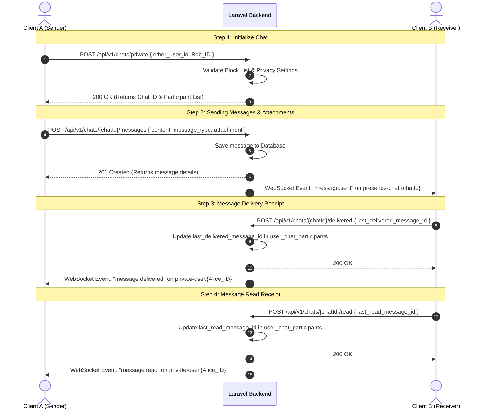
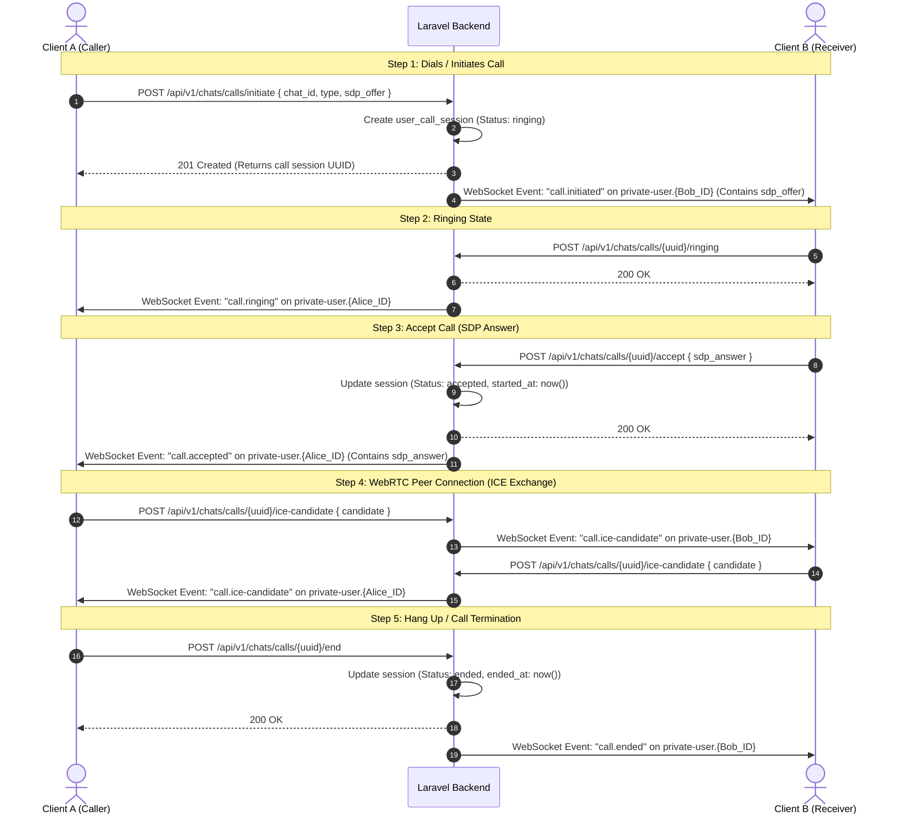

# Ivatan Real-Time Chat & WebRTC Calling Integration Documentation

This guide provides developers with the complete system architecture, authentication handshake flows, API endpoint directories, and JSON schema definitions for the real-time communication features in the **Ivatan** application.

---

## SECTION 1: ARCHITECTURE & CONNECTION SETUP

### 1. WebSocket URL Formats
Ivatan uses **Laravel Reverb** as its primary WebSocket server. The browser/mobile clients (via Laravel Echo) connect to Reverb using the following schemes:

* **Local Environment:**
  * **Protocol:** `ws://` (unencrypted)
  * **URL Format:** `ws://127.0.0.1:8080/app/{app_key}`
* **Production Environment:**
  * **Protocol:** `wss://` (encrypted SSL/TLS context)
  * **URL Format:** `wss://socket.ivatan.com/app/{app_key}`

---

### 2. WebSocket Handshake & Auth Flow
For secure private and presence channels, Laravel Reverb requires authentication. When a client attempts to subscribe to a protected channel, Laravel Echo automatically intercepts the request and performs an HTTP POST handshake to the auth endpoint.

#### Handshake Endpoint
* **HTTP Method:** `POST`
* **Path:** `/api/v1/broadcasting/auth`
* **Headers:**
  ```http
  Authorization: Bearer <Sanctum_Access_Token>
  Content-Type: application/json
  Accept: application/json
  ```
* **Request Body (JSON):**
  ```json
  {
    "socket_id": "12345.67890",
    "channel_name": "presence-chat.42"
  }
  ```
* **Success Response Payload (`200 OK`):**
  ```json
  {
    "auth": "app_key:5d8a9fde960c1d2d3a...",
    "channel_data": "{\"user_id\":1,\"user_info\":{\"id\":1,\"name\":\"John Doe\",\"username\":\"johndoe\",\"profile_photo_url\":\"https://ivatan.com/storage/avatars/1.jpg\"}}"
  }
  ```
  *(Note: `"channel_data"` is returned only for Presence Channels to distribute user details to other connected peers).*

---

### 3. Core Channels Directory

| Channel Name Pattern | Channel Type | Guard | Authorization Rules |
| :--- | :--- | :--- | :--- |
| `private-user.{id}` | **Private** | `sanctum` | Authorized only if the authenticated user's ID matches `{id}`. Used for WebRTC signaling and private user-specific events. |
| `presence-chat.{chatId}` | **Presence** | `sanctum` | Authorized if the user is an active participant in `{chatId}` and is not banned. Used for messaging, delivery/read watermarks, and group presence tracking. |

---

## SECTION 2: CHRONOLOGICAL STEP-BY-STEP LIFECYCLE FLOWS

### 1. [YES] Text Chat & File Sharing Flow


---

### 2. [YES] Audio & Video Call Flow (WebRTC Signaling)


---

### 3. [NO] Session Queuing & Waiting Lists
*(Not applicable: The project utilizes direct peer-to-peer / group real-time chats and call sessions without waiting queue pools).*

---

### 4. [NO] Wallet Billing & Transactions
*(Not applicable: The chat and voice/video call sessions are not billed per-minute or integrated with real-time wallet debiting).*

---

## SECTION 3: COMPLETE API ENDPOINTS DIRECTORY

All API endpoints require the following headers:
```http
Authorization: Bearer <Sanctum_Token>
Content-Type: application/json
Accept: application/json
```

### 1. Initiate Private Chat
* **HTTP Method & Path:** `POST /api/v1/chats/private`
* **Request Body Payload (JSON):**
  ```json
  {
    "other_user_id": 2
  }
  ```
* **Success Response (`200 OK`):**
  ```json
  {
    "success": true,
    "message": "Chat retrieved or created.",
    "data": {
      "id": 15,
      "type": "private",
      "last_message_at": "2026-06-11T16:40:00Z"
    }
  }
  ```
* **Error Response (`403 Forbidden` - User Blocked):**
  ```json
  {
    "success": false,
    "message": "Messaging blocked."
  }
  ```

### 2. Initiate Group Chat
* **HTTP Method & Path:** `POST /api/v1/chats/groups`
* **Request Body Payload (Multipart Form-Data for attachments):**
  * `name` (string, required): Group Name.
  * `participant_ids` (array, required): Array of user IDs.
  * `avatar` (file, optional): Group cover image.
* **Success Response (`201 Created`):**
  ```json
  {
    "success": true,
    "message": "Group created.",
    "data": {
      "id": 16,
      "name": "Design Team",
      "type": "group",
      "avatar_url": "https://ivatan.com/storage/chat_avatars/hash.png"
    }
  }
  ```

### 3. Send Message
* **HTTP Method & Path:** `POST /api/v1/chats/{chatId}/messages`
* **Request Body Payload (Multipart Form-Data):**
  * `content` (string, optional): Required if no attachment.
  * `message_type` (string, required): `text`, `image`, `video`, `audio`, `file`.
  * `attachment` (file, optional): Supported document, image, or audio files.
  * `reply_to_message_id` (integer, optional): Message ID being replied to.
* **Success Response (`201 Created`):**
  ```json
  {
    "success": true,
    "message": "Message sent.",
    "data": {
      "id": 1052,
      "chat_id": 15,
      "content": "Check this file",
      "message_type": "text",
      "attachment_url": null,
      "created_at": "2026-06-11T16:40:15Z"
    }
  }
  ```

### 4. Mark Messages as Read
* **HTTP Method & Path:** `POST /api/v1/chats/{chatId}/read`
* **Request Body Payload (JSON):**
  ```json
  {
    "last_read_message_id": 1052
  }
  ```
* **Success Response (`200 OK`):**
  ```json
  {
    "success": true,
    "message": "Messages marked as read."
  }
  ```

### 5. Mark Messages as Delivered
* **HTTP Method & Path:** `POST /api/v1/chats/{chatId}/delivered`
* **Request Body Payload (JSON):**
  ```json
  {
    "last_delivered_message_id": 1052
  }
  ```
* **Success Response (`200 OK`):**
  ```json
  {
    "success": true,
    "message": "Messages marked as delivered."
  }
  ```

### 6. Edit Message
* **HTTP Method & Path:** `POST /api/v1/chats/messages/{messageId}/edit`
* **Request Body Payload (JSON):**
  ```json
  {
    "content": "This is the updated content"
  }
  ```
* **Success Response (`200 OK`):**
  ```json
  {
    "success": true,
    "message": "Message edited.",
    "data": {
      "id": 1052,
      "content": "This is the updated content",
      "edited_at": "2026-06-11T16:41:00Z"
    }
  }
  ```

### 7. Delete Message
* **HTTP Method & Path:** `DELETE /api/v1/chats/messages/{messageId}`
* **Request Body Payload (JSON):**
  ```json
  {
    "delete_for_everyone": true
  }
  ```
* **Success Response (`200 OK`):**
  ```json
  {
    "success": true,
    "message": "Message deleted"
  }
  ```

### 8. Initiate Calling Session (WebRTC)
* **HTTP Method & Path:** `POST /api/v1/chats/calls/initiate`
* **Request Body Payload (JSON):**
  ```json
  {
    "chat_id": 15,
    "type": "video",
    "sdp_offer": {
      "type": "offer",
      "sdp": "v=0\r\no=- 4236... sdp offer data"
    }
  }
  ```
* **Success Response (`201 Created`):**
  ```json
  {
    "success": true,
    "message": "Call initiated.",
    "data": {
      "session": {
        "uuid": "f48c2670-653a-4efb-88a2-f9479b0c36eb",
        "chat_id": 15,
        "caller_id": 1,
        "receiver_id": 2,
        "type": "video",
        "status": "ringing"
      }
    }
  }
  ```

### 9. Accept Call (SDP Answer)
* **HTTP Method & Path:** `POST /api/v1/chats/calls/{uuid}/accept`
* **Request Body Payload (JSON):**
  ```json
  {
    "sdp_answer": {
      "type": "answer",
      "sdp": "v=0\r\no=- 8743... sdp answer data"
    }
  }
  ```
* **Success Response (`200 OK`):**
  ```json
  {
    "success": true,
    "message": "Call accepted.",
    "data": {
      "session": {
        "uuid": "f48c2670-653a-4efb-88a2-f9479b0c36eb",
        "status": "accepted",
        "started_at": "2026-06-11T16:42:30Z"
      }
    }
  }
  ```

### 10. Route ICE Candidate
* **HTTP Method & Path:** `POST /api/v1/chats/calls/{uuid}/ice-candidate`
* **Request Body Payload (JSON):**
  ```json
  {
    "candidate": {
      "candidate": "candidate:842130450 1 udp 16777215 192.168.1.100 56421 typ srflx raddr...",
      "sdpMid": "0",
      "sdpMLineIndex": 0
    }
  }
  ```
* **Success Response (`200 OK`):**
  ```json
  {
    "success": true,
    "message": "ICE Candidate broadcasted."
  }
  ```

---

## SECTION 4: REAL-TIME WEBSOCKET EVENTS REFERENCE

These are the exact JSON socket frames received by clients subscribing to the respective Reverb channels.

### 1. `message.sent`
* **Target Channel:** `presence-chat.{chatId}`
* **Trigger Condition:** Dispatched instantly when a user sends a message.
* **JSON Structure:**
  ```json
  {
    "event": "message.sent",
    "channel": "presence-chat.15",
    "data": {
      "id": 1052,
      "chat_id": 15,
      "content": "Check this file",
      "message_type": "text",
      "attachment_url": null,
      "is_mine": false,
      "status": "sent",
      "created_at": "2026-06-11T16:40:15Z",
      "sender": {
        "id": 1,
        "name": "Alice Smith",
        "avatar": "https://ivatan.com/storage/avatars/1.jpg"
      },
      "reply_to_id": null
    }
  }
  ```

### 2. `message.delivered`
* **Target Channel:** `private-user.{senderId}`
* **Trigger Condition:** Dispatched when a recipient marks a message as delivered.
* **JSON Structure:**
  ```json
  {
    "event": "message.delivered",
    "channel": "private-user.1",
    "data": {
      "chat_id": 15,
      "message_id": 1052,
      "delivered_by": 2
    }
  }
  ```

### 3. `message.read`
* **Target Channel:** `private-user.{senderId}` *(or `presence-chat.{chatId}` if group chat)*
* **Trigger Condition:** Dispatched when a recipient opens/reads messages.
* **JSON Structure:**
  ```json
  {
    "event": "message.read",
    "channel": "private-user.1",
    "data": {
      "chat_id": 15,
      "last_read_message_id": 1052,
      "read_by": 2,
      "read_at": "2026-06-11T16:41:20Z"
    }
  }
  ```

### 4. `call.initiated`
* **Target Channel:** `private-user.{receiverId}`
* **Trigger Condition:** Dispatched when a caller rings the receiver.
* **JSON Structure:**
  ```json
  {
    "event": "call.initiated",
    "channel": "private-user.2",
    "data": {
      "session_id": "f48c2670-653a-4efb-88a2-f9479b0c36eb",
      "type": "video",
      "caller": {
        "id": 1,
        "name": "Alice Smith",
        "username": "alicesmith",
        "avatar": "https://ivatan.com/storage/avatars/1.jpg"
      },
      "sdp_offer": {
        "type": "offer",
        "sdp": "v=0\r\no=- 4236... sdp offer data"
      }
    }
  }
  ```

### 5. `call.accepted`
* **Target Channel:** `private-user.{callerId}`
* **Trigger Condition:** Dispatched when a receiver picks up the call.
* **JSON Structure:**
  ```json
  {
    "event": "call.accepted",
    "channel": "private-user.1",
    "data": {
      "session_id": "f48c2670-653a-4efb-88a2-f9479b0c36eb",
      "sdp_answer": {
        "type": "answer",
        "sdp": "v=0\r\no=- 8743... sdp answer data"
      }
    }
  }
  ```

### 6. `call.ice-candidate`
* **Target Channel:** `private-user.{peerId}`
* **Trigger Condition:** Dispatched during active WebRTC candidate exchange.
* **JSON Structure:**
  ```json
  {
    "event": "call.ice-candidate",
    "channel": "private-user.2",
    "data": {
      "session_id": "f48c2670-653a-4efb-88a2-f9479b0c36eb",
      "candidate": {
        "candidate": "candidate:842130450 1 udp 16777215 192.168.1.100 56421 typ srflx raddr...",
        "sdpMid": "0",
        "sdpMLineIndex": 0
      }
    }
  }
  ```

### 7. `call.ended`
* **Target Channel:** `private-user.{peerId}`
* **Trigger Condition:** Dispatched when either user hangs up.
* **JSON Structure:**
  ```json
  {
    "event": "call.ended",
    "channel": "private-user.1",
    "data": {
      "session_id": "f48c2670-653a-4efb-88a2-f9479b0c36eb"
    }
  }
  ```

---

## SECTION 5: BEST PRACTICES & FAILSAFE MECHANISMS

### 1. Connection Recovery (Network Shifts)
* **Exponential Backoff:** Client applications (such as Web/iOS/Android wrappers) should not spam the connection endpoint when reconnecting. Use exponential backoff (e.g., reconnect after `1s`, `2s`, `4s`, `8s`, up to a max of `30s`).
* **State Synchronization on Reconnect:** When the client reconnects after being offline, they must perform an HTTP GET request to sync missed states (e.g., `/api/v1/chats/{id}/messages` fetching messages newer than the last local ID) rather than assuming WebSocket state continuity.

### 2. Timeouts
* **Ringing Timeout (30 seconds):** If a call is initiated, the caller client should start a `30-second` timer. If the server does not receive an `/accept` or `/decline` callback within 30 seconds, the caller client should automatically invoke the cancel endpoint (`POST /api/v1/chats/calls/{uuid}/cancel`) to terminate the hanging session.
* **ICE Connection Timeout:** WebRTC peer connections should time out and fallback to retry if the ICE state transitions to `failed` or remains `checking` for more than 15 seconds.

### 3. Rate Limits & Concurrency Guards
* **Debouncing Typing Indicators:** Limit sending typing indicators on the WebSocket channel to once every `3` seconds.
* **One Call at a Time:** If a user receives a new `call.initiated` frame while already in an active session, they should automatically send a `/decline` request with the parameter `{"reason": "busy"}`.

---

## SECTION 6: SERVER DEPLOYMENT & TROUBLESHOOTING

### 1. Server Deployment Runlist
When deploying these updates to your production server, execute these commands in the project directory:

```bash
# 1. Run database migrations to set up call logs & delivered watermarks
php artisan migrate

# 2. Clear cache and rebuild configs/routes caches
php artisan config:cache
php artisan route:cache

# 3. Regenerate optimized autoloader (production performance)
composer install --no-dev --optimize-autoloader

# 4. Start the Laravel Reverb WebSocket daemon (Run under Supervisor/systemd)
php artisan reverb:start
```

---

### 2. Troubleshooting & Optimization Details

#### The `"optimize-autoloader": true` Setting
By default, the project configures `"optimize-autoloader": true` in `composer.json`.
* **In Production (Benefit):** It creates a static classmap of all packages, eliminating slow directory scans and file-check operations (`file_exists`), which reduces CPU overhead and latency.
* **In Local Development (Windows):** If local file systems are slow, indexed, or monitored by an active antivirus, running `composer install` or `composer dump-autoload` might scan and index thousands of files. If it causes commands to timeout, you can run them with:
  ```bash
  composer dump-autoload --no-optimization
  ```

#### Local Development Connection Errors during `post-autoload-dump`
If you regenerate composer autoload configurations locally while your MySQL server is shut down, you will see a database error during the post-install script:
```text
SQLSTATE[HY000] [2002] No connection could be made because the target machine actively refused it
Script @php artisan package:discover --ansi handling the post-autoload-dump event returned with error code 1
```
* **Why this happens:** Laravel's `DynamicConfigServiceProvider` boots during the artisan hook `package:discover` and attempts to query the database configuration settings. If MySQL is turned off, this bootstrap query fails.
* **Is it safe?** **Yes.** The autoloader classmaps are successfully generated *before* this hook runs. On the production server where MySQL is active, the `package:discover` script will run completely without error.
