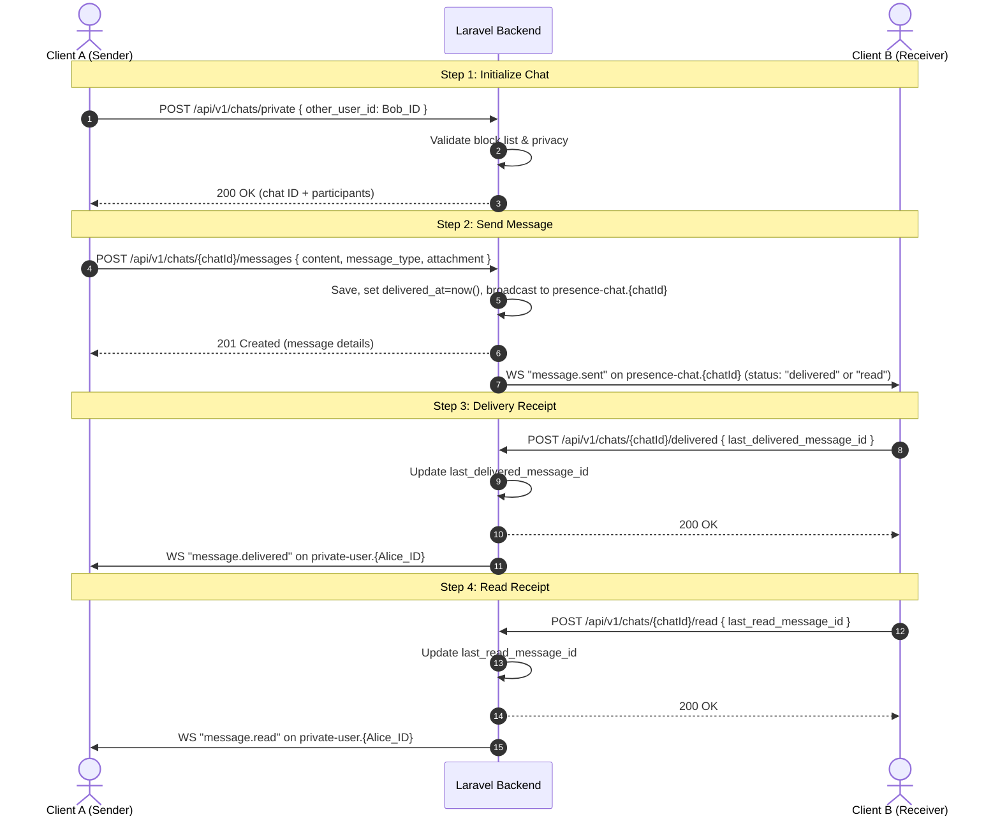
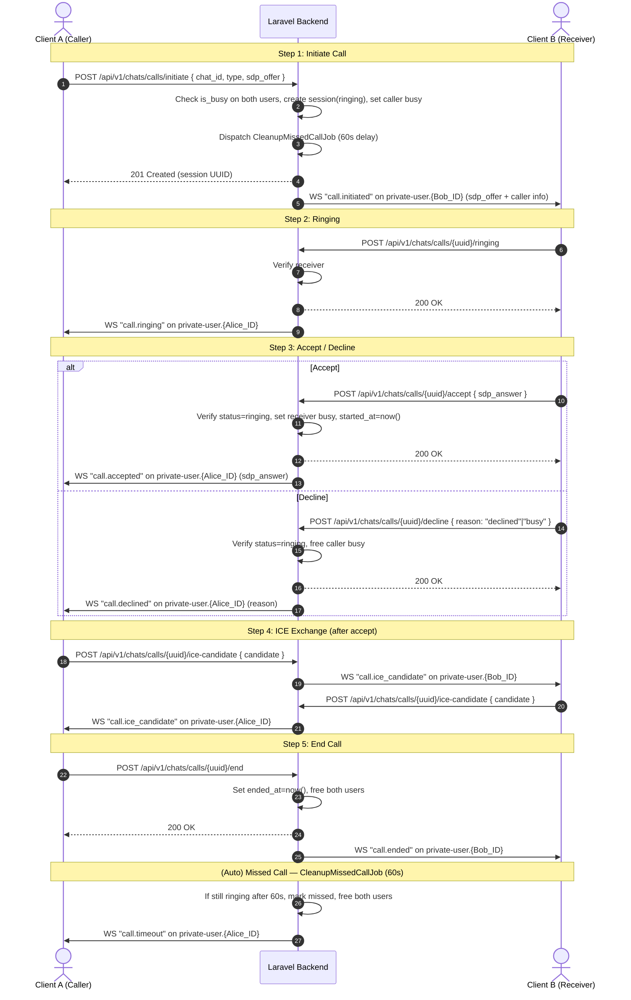
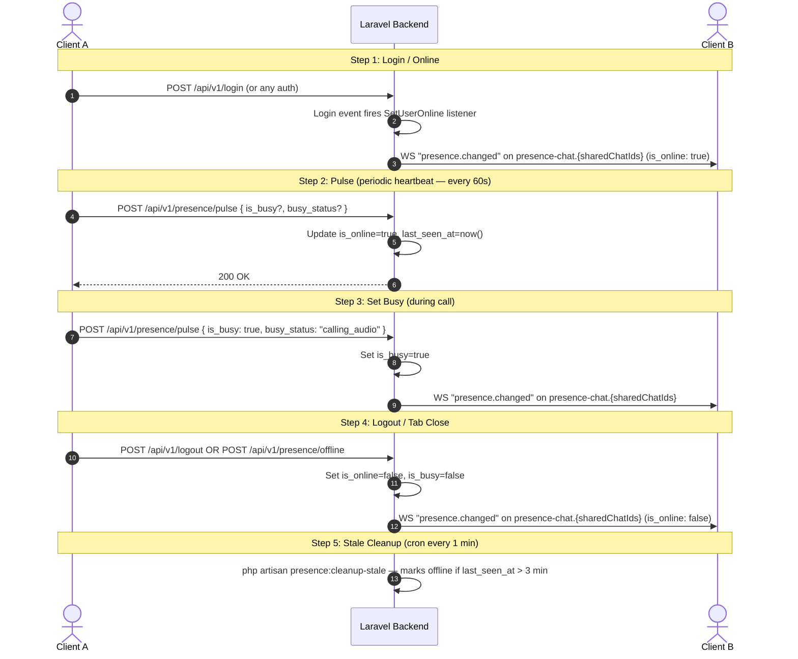

# Ivatan Real-Time Chat, Presence & WebRTC Calling — Integration Guide

Complete system architecture, auth handshake flows, API directories, WebSocket event schemas, and deployment steps for the real-time communication features.

---

## SECTION 1: ARCHITECTURE & CONNECTION SETUP

### 1. WebSocket URL Formats

Ivatan uses **Laravel Reverb** as its primary WebSocket server. Browser/mobile clients (via Laravel Echo) connect to Reverb using:

| Environment | Protocol | URL Format |
|:---|---|:---|
| **Local** | `ws://` | `ws://127.0.0.1:8080/app/{app_key}` |
| **Production** | `wss://` | `wss://socket.ivatan.com/app/{app_key}` |

---

### 2. WebSocket Handshake & Auth Flow

When a client subscribes to a private or presence channel, Echo sends an HTTP POST to the auth endpoint.

**Handshake Endpoint**

```
POST /api/v1/broadcasting/auth
```

**Headers:**
```http
Authorization: Bearer <Sanctum_Access_Token>
Content-Type: application/json
Accept: application/json
```

**Request Body (JSON):**
```json
{
  "socket_id": "12345.67890",
  "channel_name": "presence-chat.42"
}
```

**Success Response (`200 OK`):**
```json
{
  "auth": "app_key:5d8a9fde960c1d2d3a...",
  "channel_data": "{\"user_id\":1,\"user_info\":{\"id\":1,\"name\":\"John Doe\",\"username\":\"johndoe\",\"profile_photo_url\":\"https://ivatan.com/storage/avatars/1.jpg\"}}"
}
```

> `channel_data` is returned **only** for Presence Channels — it distributes user details to other connected peers.

---

### 3. Core Channels Directory

| Channel Pattern | Type | Guard | Auth Rule |
|:---|---|:---|:---|
| `App.Models.User.{id}` | Private | `web`, `admin` | User ID matches — used for general Laravel notifications (web/admin guard) |
| `chat.{chatId}` | Private | `web`, `admin` | User is participant OR is admin — legacy admin channel |
| `private-user.{id}` | Private | `sanctum` | User ID matches — used for WebRTC signaling, delivery/read receipts, group notifications, comment notifications |
| `presence-chat.{chatId}` | **Presence** | `sanctum` | User is active participant AND not banned — returns `{id, name, username, profile_photo_url}` for peer tracking |

> **Important:** `private-user.{id}` and `presence-chat.{chatId}` both require `sanctum` guard (API token).  
> The admin panel's session-based users authenticate via Sanctum's SPA fallback to the `web` guard session, so they can also subscribe.

---

## SECTION 2: LIFECYCLE FLOWS

### 1. Text Chat & File Sharing



---

### 2. Audio & Video Call (WebRTC Signaling)



---

### 3. Presence Tracking



---

### 4. Group & Moderation Events

| Event | Channel | Trigger |
|:---|---|:---|
| `group.created` | `private-user.{participantId}` | New group created |
| `group.updated` | `presence-chat.{chatId}` | Group name/avatar changed |
| `participant.added` | `presence-chat.{chatId}` + `private-user.{addedUser}` | New member added |
| `participant.left` | `presence-chat.{chatId}` | Member left |
| `participant.removed` | `presence-chat.{chatId}` + `private-user.{removedUser}` | Member removed by admin |
| `participant.banned` | `presence-chat.{chatId}` | Member banned |
| `participant.unbanned` | `presence-chat.{chatId}` | Member unbanned |
| `participant.muted` | `presence-chat.{chatId}` | Member muted |
| `participant.unmuted` | `presence-chat.{chatId}` | Member unmuted |
| `admin.status.changed` | `presence-chat.{chatId}` | Admin promoted/demoted |
| `message.edited` | `presence-chat.{chatId}` | Message edited |
| `message.deleted` | `presence-chat.{chatId}` | Message deleted (everyone or me) |

---

## SECTION 3: COMPLETE API ENDPOINTS

All endpoints require:
```http
Authorization: Bearer <Sanctum_Token>
Content-Type: application/json
Accept: application/json
```

### Chat Endpoints

| Method | Path | Description |
|:---|---|:---|
| `GET` | `/api/v1/chats` | List user's chats (inbox) |
| `POST` | `/api/v1/chats/private` | Open/create private chat |
| `POST` | `/api/v1/chats/group` | Create group chat |
| `GET` | `/api/v1/chats/{chatId}` | Show chat details |
| `GET` | `/api/v1/chats/{chatId}/messages` | Get messages (paginated) |
| `POST` | `/api/v1/chats/{chatId}/messages` | Send message |
| `POST` | `/api/v1/chats/{chatId}/read` | Mark as read |
| `POST` | `/api/v1/chats/{chatId}/delivered` | Mark as delivered |
| `POST` | `/api/v1/chats/messages/{messageId}/edit` | Edit message |
| `DELETE` | `/api/v1/chats/messages/{messageId}` | Delete message |
| `POST` | `/api/v1/chats/{chatId}/participants` | Add participants |
| `POST` | `/api/v1/chats/{chatId}/leave` | Leave group |

### Call Endpoints

| Method | Path | Description |
|:---|---|:---|
| `POST` | `/api/v1/chats/calls/initiate` | Initiate call (sets caller busy, checks receiver busy) |
| `POST` | `/api/v1/chats/calls/{uuid}/ringing` | Send ringing signal to caller |
| `POST` | `/api/v1/chats/calls/{uuid}/accept` | Accept call (sets receiver busy) |
| `POST` | `/api/v1/chats/calls/{uuid}/decline` | Decline call (frees caller busy) |
| `POST` | `/api/v1/chats/calls/{uuid}/cancel` | Cancel call (frees caller busy) |
| `POST` | `/api/v1/chats/calls/{uuid}/busy` | Signal busy (frees caller busy) |
| `POST` | `/api/v1/chats/calls/{uuid}/end` | End call (frees both users) |
| `POST` | `/api/v1/chats/calls/{uuid}/ice-candidate` | Relay ICE candidate |

### Presence Endpoints

| Method | Path | Description |
|:---|---|:---|
| `POST` | `/api/v1/presence/pulse` | Heartbeat — updates `is_online`, `last_seen_at`, optionally `is_busy`/`busy_status` |
| `POST` | `/api/v1/presence/offline` | Explicitly set user offline |

---

## SECTION 4: WEBSOCKET EVENTS REFERENCE

### `message.sent`
- **Channel:** `presence-chat.{chatId}`
- **Trigger:** After a message is saved
```json
{
  "event": "message.sent",
  "channel": "presence-chat.15",
  "data": {
    "id": 1052,
    "chat_id": 15,
    "content": "Check this file",
    "message_type": "text",
    "attachment_url": null,
    "is_mine": false,
    "status": "delivered",
    "created_at": "2026-06-11T16:40:15Z",
    "sender": { "id": 1, "name": "Alice", "avatar": "https://..." },
    "reply_to_id": null
  }
}
```

### `message.delivered`
- **Channel:** `private-user.{senderId}`
- **Trigger:** Recipient marks as delivered
```json
{
  "event": "message.delivered",
  "channel": "private-user.1",
  "data": { "chat_id": 15, "message_id": 1052, "delivered_by": 2 }
}
```

### `message.read`
- **Channel:** `private-user.{senderId}` (private) or `presence-chat.{chatId}` (group)
- **Trigger:** Recipient marks as read
```json
{
  "event": "message.read",
  "channel": "private-user.1",
  "data": {
    "chat_id": 15,
    "last_read_message_id": 1052,
    "read_by": 2,
    "read_at": "2026-06-11T16:41:20Z"
  }
}
```

### `message.edited`
- **Channel:** `presence-chat.{chatId}`
```json
{
  "event": "message.edited",
  "data": { "chat_id": 15, "message_id": 1052, "new_content": "Updated", "edited_at": "..." }
}
```

### `message.deleted`
- **Channel:** `presence-chat.{chatId}`
```json
{
  "event": "message.deleted",
  "data": { "chat_id": 15, "message_id": 1052, "delete_type": "everyone", "deleted_by": 1 }
}
```

### `presence.changed`
- **Channel:** `presence-chat.{chatId}`
- **Trigger:** User comes online/goes offline/changes busy status
```json
{
  "event": "presence.changed",
  "data": { "user_id": 1, "is_online": true, "last_seen_at": "2026-06-11T16:40:00Z" }
}
```

### `call.initiated`
- **Channel:** `private-user.{receiverId}`
```json
{
  "event": "call.initiated",
  "data": {
    "call_session_uuid": "f48c2670-...",
    "caller_info": { "id": 1, "name": "Alice", "username": "alice", "avatar": "..." },
    "type": "video",
    "sdp_offer": { "type": "offer", "sdp": "..." }
  }
}
```

### `call.ringing`
- **Channel:** `private-user.{callerId}`
```json
{
  "event": "call.ringing",
  "data": { "call_session_uuid": "f48c2670-...", "status": "ringing" }
}
```

### `call.accepted`
- **Channel:** `private-user.{callerId}`
```json
{
  "event": "call.accepted",
  "data": { "call_session_uuid": "f48c2670-...", "sdp_answer": { "type": "answer", "sdp": "..." } }
}
```

### `call.declined`
- **Channel:** `private-user.{callerId}`
```json
{
  "event": "call.declined",
  "data": { "call_session_uuid": "f48c2670-...", "reason": "declined" }
}
```

### `call.cancelled`
- **Channel:** `private-user.{receiverId}`
```json
{
  "event": "call.cancelled",
  "data": { "call_session_uuid": "f48c2670-...", "status": "cancelled" }
}
```

### `call.busy`
- **Channel:** `private-user.{callerId}`
```json
{
  "event": "call.busy",
  "data": { "call_session_uuid": "f48c2670-...", "status": "busy" }
}
```

### `call.timeout`
- **Channel:** `private-user.{peerId}`
- **Trigger:** `CleanupMissedCallJob` fires after 60s of no answer
```json
{
  "event": "call.timeout",
  "data": { "call_session_uuid": "f48c2670-...", "status": "no_answer" }
}
```

### `call.ice_candidate`
- **Channel:** `private-user.{peerId}`
```json
{
  "event": "call.ice_candidate",
  "data": {
    "call_session_uuid": "f48c2670-...",
    "candidate": { "candidate": "...", "sdpMid": "0", "sdpMLineIndex": 0 }
  }
}
```

### `call.ended`
- **Channel:** `private-user.{peerId}`
```json
{
  "event": "call.ended",
  "data": { "call_session_uuid": "f48c2670-...", "status": "ended" }
}
```

### Group Events
All broadcast on `presence-chat.{chatId}` (and some on `private-user.{id}`):

| Event | Data Keys |
|:---|---|
| `group.created` | `chat_id`, `group_name`, `created_by` |
| `group.updated` | `chat_id`, `updated_fields` |
| `participant.added` | `chat_id`, `added_user`, `added_by` |
| `participant.left` | `chat_id`, `user_id` |
| `participant.removed` | `chat_id`, `removed_user_id`, `removed_by` |
| `participant.banned` | `chat_id`, `user_id` |
| `participant.unbanned` | `chat_id`, `user_id` |
| `participant.muted` | `chat_id`, `user_id`, `muted_until` |
| `participant.unmuted` | `chat_id`, `user_id` |
| `admin.status.changed` | `chat_id`, `user_id`, `is_admin`, `updated_by` |

---

## SECTION 5: BEST PRACTICES & FAILSAFE MECHANISMS

### 1. Connection Recovery

- **Exponential backoff:** Reconnect after `1s`, `2s`, `4s`, `8s`... max `30s`.
- **State sync on reconnect:** `GET /api/v1/chats/{id}/messages?after_id={lastId}` to re-sync missed messages.
- **Presence recovery:** Clients should send `POST /api/v1/presence/pulse` immediately after reconnecting (Echo auto-reattaches to channels, but the server needs the heartbeat to reset `last_seen_at`).

### 2. Timeouts

| Timeout | Value | Behavior |
|:---|---|:---|
| **Ringing timeout** | **60 seconds** | `CleanupMissedCallJob` fires → marks call `missed`, frees both users, broadcasts `call.timeout` |
| **Client-side ringing timer** | 60 seconds | Local timer: if no accept/decline within 60s, show "No answer" UI |
| **ICE connection timeout** | 15 seconds | WebRTC peer connection: if ICE state is `failed` or `checking` for > 15s, abort and retry |
| **Presence stale threshold** | 3 minutes | `php artisan presence:cleanup-stale` (cron every 1 min) marks users offline if `last_seen_at > 3 min ago` |

### 3. `is_busy` Guard

- When a user **initiates** a call → `is_busy = true`, `busy_status = "calling_audio"` or `"calling_video"`
- When a user **accepts** a call → `is_busy = true` for receiver too
- When call **ends / declines / cancels / timeouts** → both users freed (`is_busy = false`)
- `initiate` endpoint **rejects** with `409 Conflict` if either user is already busy

### 4. Concurrency Guards

- **Race condition on accept/decline:** Both endpoints check `status === 'ringing'` before mutating. If the cleanup job already marked it `missed`, the request returns `400 Call session is no longer active.`
- **One call at a time:** If a user receives `call.initiated` while already in a call, they should decline with `reason: "busy"` (client-side responsibility).
- **Debounce typing indicators:** Limit to one event per 3 seconds.

---

## SECTION 6: SERVER DEPLOYMENT

### 1. Deployment Runlist

```bash
# 1. Run migrations (call logs, delivered/read watermarks, is_busy)
php artisan migrate

# 2. Cache for production
php artisan config:cache
php artisan route:cache

# 3. Optimize autoloader
composer install --no-dev --optimize-autoloader

# 4. Start Reverb daemon (under Supervisor/systemd)
php artisan reverb:start
```

### 2. Cron Setup

Add the following to your crontab for presence cleanup and scheduled tasks:

```cron
* * * * * cd /path/to/project && php artisan schedule:run >> /dev/null 2>&1
```

This runs every minute. The schedule includes:
- `presence:cleanup-stale` — every minute, marks users offline if `last_seen_at > 3 min ago`
- Other project tasks (trending scores, abandoned cart restore, subscription expiry, payment health checks)

### 3. Environment Variables (.env)

```dotenv
# Reverb
REVERB_APP_KEY=your-app-key
REVERB_APP_SECRET=your-app-secret
REVERB_APP_ID=your-app-id
REVERB_HOST=localhost
REVERB_PORT=8080
REVERB_SCHEME=http
REVERB_SERVER_PORT=8080
VITE_REVERB_HOST=localhost
VITE_REVERB_PORT=8080
VITE_REVERB_SCHEME=http

# Broadcasting
BROADCAST_CONNECTION=reverb
BROADCAST_DRIVER=reverb
```

### 4. Supervisor Configuration (Reverb)

```ini
[program:reverb]
process_name=%(program_name)s_%(process_num)02d
command=php /path/to/project/artisan reverb:start
autostart=true
autorestart=true
user=www-data
numprocs=1
redirect_stderr=true
stdout_logfile=/path/to/project/storage/logs/reverb.log
```

### 5. Nginx WebSocket Proxy (if using reverse proxy)

```nginx
location /app/ {
    proxy_pass http://127.0.0.1:8080;
    proxy_http_version 1.1;
    proxy_set_header Upgrade $http_upgrade;
    proxy_set_header Connection "upgrade";
    proxy_set_header Host $host;
    proxy_set_header X-Real-IP $remote_addr;
    proxy_read_timeout 86400;
}
```

---

## SECTION 7: TROUBLESHOOTING

### `composer dump-autoload` fails with MySQL error

```
SQLSTATE[HY000] [2002] No connection could be made because the target machine actively refused it
```

**Cause:** `DynamicConfigServiceProvider` queries the DB during `package:discover`.  
**Safety:** Composer classmaps are generated before the hook — the error is cosmetic. Run with `--no-optimization` locally:

```bash
composer dump-autoload --no-optimization
```

### WebSocket connection fails with `401 Unauthorized`

- Ensure the client passes a valid `Authorization: Bearer <token>` header
- Verify `SANCTUM_STATEFUL_DOMAINS` includes your frontend domain
- Check `php artisan config:cache` was re-run after env changes

### WebRTC call fails silently

- Check Reverb logs: `storage/logs/reverb.log` or `storage/logs/laravel.log`
- Verify `max_message_size` in `config/reverb.php` is at least `262_144` (256 KB) — SDP offers can exceed 10 KB
- Verify `max_request_size` in `config/reverb.php` is also at least `262_144`
- Ensure both peers have `accept_client_events_from` containing `['members']`

### Presence shows wrong online status

- The `presence:cleanup-stale` cron command must be running
- On user logout or tab close, the frontend should call `POST /api/v1/presence/offline`
- The `Pulse` heartbeat should fire every 60s from the client to keep `last_seen_at` fresh
